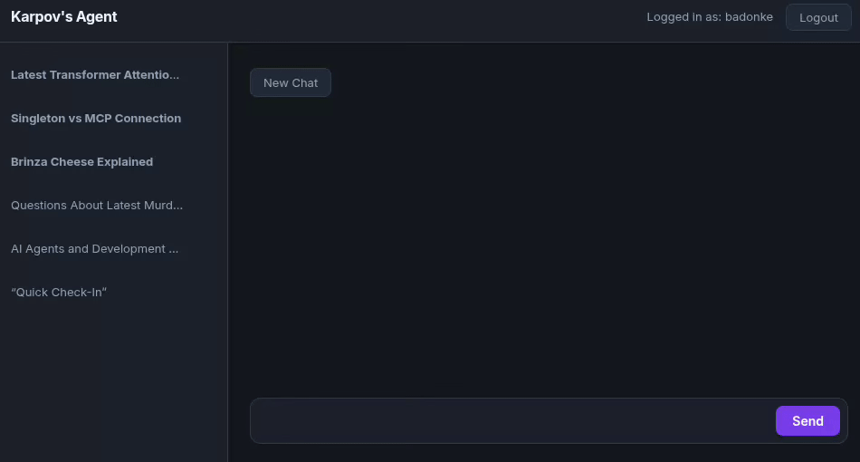
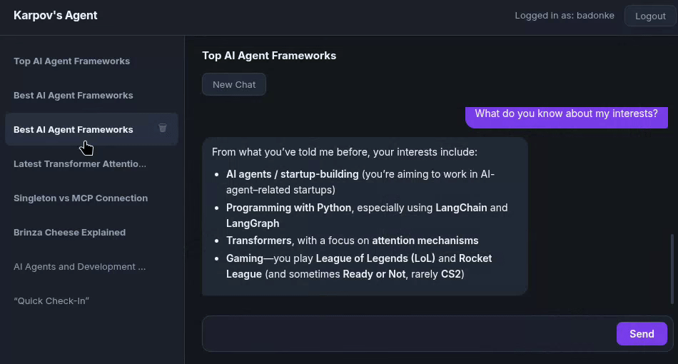
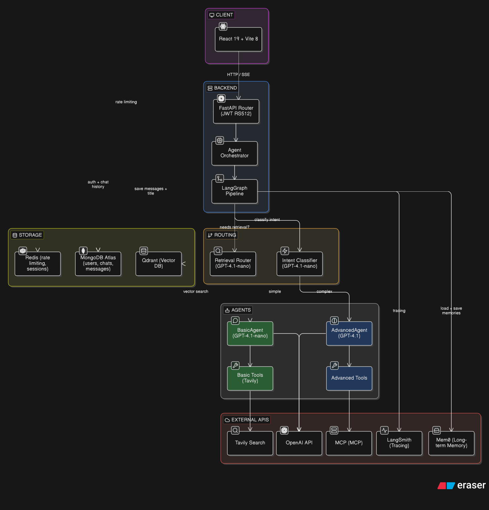

<div align="center">

<a href="https://github.com/ItayKarp/Dual-agent">
  
</a>

<br/>


A full-stack AI chat application with a React frontend and a multi-agent FastAPI backend.
Features real-time streaming, persistent chat history, RAG-powered similarity search, cross-session memory, and intelligent LangGraph-based query routing.

<br/>


<br/>


</div>

---

## Table of Contents

- [Features](#features)
- [Architecture](#architecture)
- [Tech Stack](#tech-stack)
- [Getting Started](#getting-started)
- [API Reference](#api-reference)
- [Project Structure](#project-structure)

---

## Features

| | Feature | Description |
|---|---|---|
| 🔀 | **LangGraph Orchestration** | A stateful `StateGraph` with five nodes — `setup`, `retrieve_docs`, `basic_agent`, `advanced_agent`, and `finalize` — replaces the old linear orchestrator. Each request flows through the graph with full checkpointing via `MemorySaver`. |
| 🔍 | **Dual Intent Classification** | GPT-5.4-nano runs two parallel classifiers: one routes to BasicAgent or AdvancedAgent based on query complexity; the other decides whether to trigger RAG retrieval from the campus knowledge base. |
| 📚 | **RAG / Similarity Search** | Qdrant vector database stores campus knowledge (grading, financial aid, housing, etc.). On relevant queries, the user's prompt is embedded and the top matching documents are retrieved and injected into the agent's context. |
| ⚡ | **Streaming AI Responses** | Tokens stream in real-time via SSE using `graph.astream_events`. Tool calls and search steps appear as visible chain-of-thought thoughts alongside the response. |
| 💾 | **Persistent Chat History** | Conversations stored in MongoDB with Redis caching and LLM-generated titles. |
| 🧠 | **Cross-Session Memory** | After each response, an LLM extracts long-term user facts via Mem0; relevant memories are semantically retrieved and injected into every new prompt. |
| 🌐 | **Web Search & Academic Papers** | Tavily for web search; arXiv MCP server and fetch MCP server available to the AdvancedAgent. |
| 🔭 | **LangSmith Tracing** | Full observability of every graph run, node transition, LLM call, and tool invocation via LangSmith. |
| 📝 | **Markdown Rendering** | AI responses render with full markdown support. |
| 🔐 | **JWT Authentication** | RS512-signed access/refresh token flow with bcrypt password hashing and rate limiting. |

---

## Architecture



### LangGraph Flow

```
START
  └─► setup          (parallel: intent classify + memory retrieve)
        └─► retrieve_docs  (Qdrant similarity search if needed)
              ├─► basic_agent    (Tavily search)
              └─► advanced_agent (Tavily + arXiv + fetch)
                    └─► finalize (parallel: LLM title + Mem0 memory update)
                          └─► END
```

---

## Tech Stack

| Layer | Technology |
|---|---|
| Frontend | React 19, Vite 8, React Router 7 |
| Markdown | react-markdown |
| Web Framework | FastAPI |
| AI Orchestration | LangGraph StateGraph + LangChain-MCP-Adapters |
| LLM | OpenAI GPT-5.4 / GPT-5.4-nano |
| Vector Search | Qdrant (async) + OpenAI Embeddings |
| Database | MongoDB Atlas via Motor (async) |
| Cache | Redis Cloud Labs via redis-py (async) |
| Memory | Mem0 API |
| Search | Tavily |
| Observability | LangSmith |
| Auth | JWT (RS512) + bcrypt |
| Package Manager | uv (backend), npm (frontend) |

---

## Getting Started

### Prerequisites

- Node.js 18+
- Python 3.14
- [`uv`](https://github.com/astral-sh/uv) package manager
- MongoDB Atlas cluster
- Redis instance
- Qdrant instance (cloud or self-hosted)
- RSA key pair in `backend/certs/` for JWT signing

### Backend

```bash
cd backend
uv venv
source .venv/bin/activate
uv sync
```

<details>
<summary><b>Environment variables</b> — use <code>backend/.env.example</code> and rename to .env</summary>

```env
MONGODB_URI=<your-mongodb-atlas-uri>

OPENAI_API_KEY=<your-openai-key>
TAVILY_API_KEY=<your-tavily-key>
MEM0_API_KEY=<your-mem0-key>

REDIS_HOST=<your-redis-host>
REDIS_PORT=<your-redis-port>
REDIS_USER=default
REDIS_PASS=<your-redis-password>

JWT_ALGORITHM=RS512
JWT_PRIVATE_KEY_PATH=./certs/private_key.pem
JWT_PUBLIC_KEY_PATH=./certs/public_key.pem

LANGSMITH_TRACING=true
LANGSMITH_ENDPOINT=https://eu.api.smith.langchain.com
LANGSMITH_API_KEY=<your-langsmith-api-key>
LANGSMITH_PROJECT="dual-agent-project"

QDRANT_API_KEY=<your-qdrant-api-key>
QDRANT_URL=<your-qdrant-url>
QDRANT_COLLECTION_NAME=<your-collection-name>
QDRANT_EMBEDDING_MODEL=<your-embedding-model>
```

</details>

```bash
uvicorn app.main:app --reload
```

API available at `http://localhost:8000`.

### Frontend

```bash
cd frontend
npm install
npm run dev
```

The app expects the backend at `http://localhost:8000`. Update the base URL in `src/api/` if needed.

---

## API Reference

| Method | Endpoint | Description | Auth |
|--------|----------|-------------|:----:|
| `POST` | `/auth/register` | Register a new user | — |
| `POST` | `/auth/login` | Login and receive tokens | — |
| `POST` | `/auth/refresh` | Refresh access token | — |
| `POST` | `/chat` | Send a message (streaming SSE) | ✓ |
| `GET` | `/chats` | List all chats for current user | ✓ |
| `GET` | `/chat/{chat_id}` | Retrieve a full chat with messages | ✓ |
| `DELETE` | `/chat/{chat_id}` | Delete a chat | ✓ |

---

## Project Structure

<details>
<summary><b>Frontend</b></summary>

```
frontend/src/
├── api/          # API calls (auth, chat)
├── components/   # Chat, ChatList
├── context/      # AuthContext
├── hooks/        # useAuthFetch, useAutoScroll
└── pages/        # Home, Login, Register, ForgotPassword
```

</details>

<details>
<summary><b>Backend</b></summary>

```
backend/app/
├── agents/
│   ├── graph/              # LangGraph: state, nodes, edges, graph builder
│   ├── basic_agent.py      # Tavily-only agent
│   ├── advanced_agent.py   # Tavily + arXiv + fetch agent
│   └── base_class.py       # Shared agent base
├── orchestrator/           # AgentOrchestrator (entry point for requests)
├── tools/                  # Tavily search tools
├── services/
│   ├── intent_classifier_service.py  # Dual classifier (mode + retrieval routing)
│   ├── streaming_service.py          # SSE stream via graph.astream_events
│   ├── memory_service.py             # Mem0 memory extraction
│   └── title_service.py              # LLM-generated chat titles
├── api/
│   ├── routers/            # /chat, /auth/*, /chats endpoints
│   ├── dependencies.py     # Dependency injection (graph, services, repos)
│   └── auth_dependencies.py
├── infrastructure/
│   ├── db/                 # MongoDB, Redis, Mem0, Qdrant client managers
│   └── repositories/       # ChatRepository, AuthRepository, QdrantRepository
├── core/                   # App config, lifespan, MCP setup
└── models/                 # Pydantic schemas & DTOs
```

</details>
